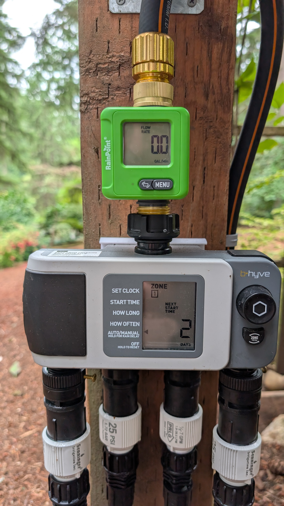
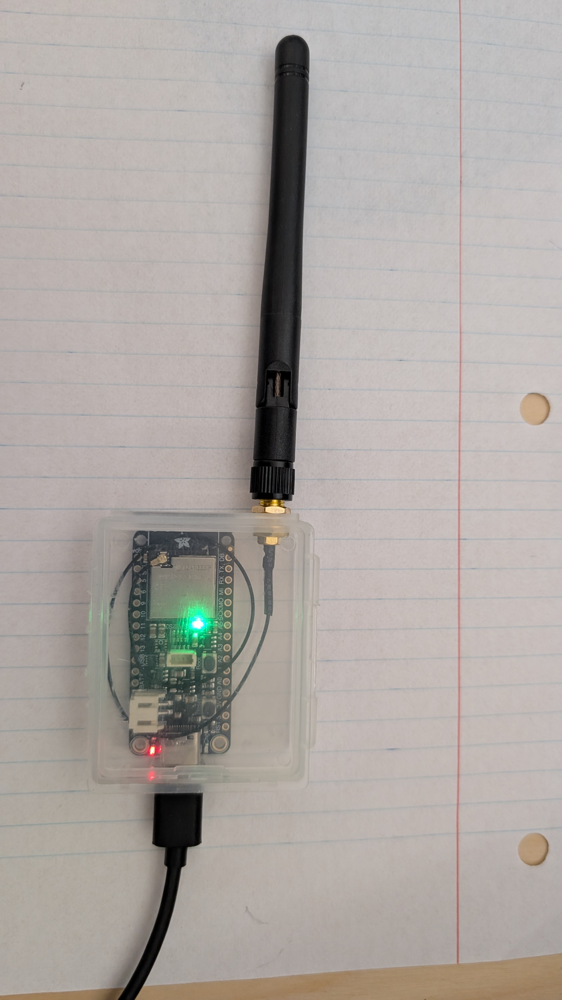

# RainPoint HCS048B — Local BLE Flow Meter Monitoring

Local, cloud-free monitoring for the [RainPoint HCS048B Smart Bluetooth Water Flow Meter](https://www.rainpoint.com/products/rainpoint-smart-bluetooth-water-flow-meter-with-app-control) ([official overview](https://service.rainpointonline.com/hc/en-us/articles/17339659067023-RAINPOINT-HCS048B-Overview-Getting-Started)), via an ESP32 running [ESPHome](https://esphome.io/), publishing to MQTT for consumption by Prometheus/Grafana, Home Assistant, or both at once.

No app, no cloud account, no connection to the meter at all — this reads the meter's own passive BLE advertisements directly.



*A real installation: the meter sits inline between the hose bib and a B-hyve controller, giving whole-system flow monitoring regardless of which zone is running — the same data this project reads over BLE instead of the meter's own tiny screen.*

## Table of Contents

- [Why this exists](#why-this-exists)
- [How it works](#how-it-works)
- [Hardware](#hardware)
- [Repository contents](#repository-contents)
- [Getting started](#getting-started)
- [Adding your own meter(s)](#adding-your-own-meters)
- [MQTT message reference](#mqtt-message-reference)
- [Prometheus / Grafana, via mqtt-exporter](#prometheus--grafana-via-mqtt-exporter)
- [Home Assistant](#home-assistant)
- [Known limitations](#known-limitations)
- [How this was reverse engineered](#how-this-was-reverse-engineered)
- [Disclaimer](#disclaimer)

## Why this exists

The RainPoint app is the only supported way to see this meter's data, with no local API, no MQTT, no export. This project reverse engineers the meter's own BLE broadcast to pull that data locally — no RainPoint account, no cloud dependency, no risk of the app or a backend service going away and taking your data with it.

## How it works

The key discovery this project is built on: **the meter broadcasts everything you need in its own BLE advertisement, with no connection required.** No pairing, no GATT handshake, no app in the loop. A single passive listener can pick up as many meters as are in range, simultaneously, indefinitely, without ever contending with the RainPoint app's own connection to the same device.

### The advertisement payload

Each meter advertises a custom 32-bit BLE Service UUID (`0x011b9191`) carrying a Service Data payload. The payload's length varies slightly (the meter occasionally includes one extra byte earlier in the payload for reasons that don't affect the data itself — see [Known limitations](#known-limitations)), so this project parses it **anchored from the end of the payload**, not from a fixed offset at the start. The trailing 15 bytes are always three fixed blocks of `[1-byte marker][4-byte little-endian value]`:

| Marker byte | Field | Meaning |
|---|---|---|
| `0x9F` | Last Session Usage | Gallons used in the most recently *completed* flow session. Set once, when a session ends; holds steady until the next one ends. |
| `0xCB` | Total Today | Cumulative gallons used since the meter's internal day boundary. |
| `0xB3` | Total Usage | Cumulative lifetime gallons. Monotonically increasing (short of a meter reset). |

**Scale factor**: 1 raw count = 0.1 L = **0.0264172 US gallons**. Confirmed empirically against the RainPoint app's own displayed readings across multiple independent flow sessions, not assumed from the sensor's nominal spec.

The meter advertises roughly once per second. Because its own counter only ticks in those coarse 0.0264-gallon steps, computing a flow rate from consecutive individual samples is noisy by nature (some 1-second windows catch one tick, others catch two, by pure timing luck) — this project averages flow rate over a rolling ~15-second window rather than per-sample, which produces a stable reading.

## Hardware

**Any BLE5-capable ESP32 (S3 recommended)** works. This project has run on both:

- **M5Stamp-S3A** — compact, works well, but limited by its onboard chip antenna.
- **Adafruit ESP32-S3 Feather (8MB, w.FL antenna)** — [product page](https://www.adafruit.com/product/5885). Recommended if BLE range/reliability is a concern, since the external antenna connector is a real, meaningful upgrade over any onboard chip antenna. Paired with:
  - [2.4GHz dipole antenna, RP-SMA, 5dBi](https://www.adafruit.com/product/945)
  - [RP-SMA to w.FL/MHF3/IPEX3 adapter cable](https://www.adafruit.com/product/5444) — **note the connector spec carefully**: this board uses w.FL/MHF3/IPEX3, which is a different (if confusingly similar-looking) connector family from the more common u.FL — the wrong adapter won't physically mate correctly.

  - ESPHome board id for the Feather: `adafruit_feather_esp32s3_nopsram`.



### Status LEDs (Adafruit Feather only)

If using the Feather board, this config drives its two onboard LEDs for at-a-glance status:

- **NeoPixel** (GPIO33 data, GPIO21 power-enable — the power pin must be driven high or the LED does nothing): green when WiFi is connected, red when it isn't.
- **Plain red LED** (GPIO13, `LED_BUILTIN`): brief flash on every MQTT flow-data publish, as an activity indicator.

## Repository contents

| File | Purpose |
|---|---|
| `RP_flow.yaml` | Main ESPHome configuration |
| `meter_state.h` | Small fixed-size C++ header tracking per-meter state (last counter value, timestamps, rolling flow-rate window) — included via ESPHome's `esphome.includes` |
| `secrets.yaml` | WiFi/MQTT/OTA credentials (not committed with real values — see below) |

## Getting started

1. Copy `secrets.yaml` and fill in your own WiFi SSID/password, MQTT broker address, and an OTA password. If your MQTT broker doesn't use authentication, remove the `username:`/`password:` lines from the `mqtt:` block in `RP_flow.yaml` entirely rather than leaving them pointing at blank secrets — an empty-string credential is not the same thing as a truly anonymous connection to some brokers.
2. Set `node_name` in the `substitutions:` block at the top of `RP_flow.yaml` — this drives the WiFi hostname, MQTT client id, and topic prefix for this specific physical board.
3. Flash via USB the first time (`esphome run RP_flow.yaml`); OTA updates work after that.
4. Running a second physical node? Copy the file, change only `node_name` (e.g. `flowmeter-node2`), and flash the second board. Both nodes run identical logic and will each independently publish data for whatever meters they can hear — if both happen to hear the same meter, that's harmless redundancy, not a conflict.

## Adding your own meter(s)

This config doesn't hardcode meter addresses for its core scanning logic — it matches any BLE advertiser whose MAC starts with `meter_mac_prefix` (set in `substitutions:`) and carries the expected `meter_service_uuid`. If your HCS048B (or a meter from the same product line) shares that prefix, it's picked up automatically, with no config changes, the moment it's in range.

**Finding your meter's specific address**, without touching BLE at all: once this is running, it's already publishing to a topic named after each meter's own MAC suffix. The entire BLE MAC address is available from the RainPoint App, under "Device Information" for the meter of interest.
Or you can capture your WiFi traffic in Wireshark (or a saved `.pcapng`) and apply this display filter:

```
mqtt.msgtype == 3 and mqtt.topic contains "flowmeter/"
```

Each matching packet's Topic column shows something like `flowmeter/A1B2` — that's your meter's suffix, ready to use if you want to add [Home Assistant](#home-assistant) support for it specifically. If you have multiple meters and aren't sure which is which, run water at just one and watch which topic's values change.

If your meter is a different make or protocol entirely, this byte-level parsing was reverse engineered specifically for the HCS048B's advertisement format — adapting it to a different product is a bigger undertaking than a config change; see [How this was reverse engineered](#how-this-was-reverse-engineered) for the approach that would need repeating.

## MQTT message reference

**Flow data** — published to `flowmeter/<XXYY>` (where `XXYY` is the meter's MAC suffix) on every plausible advertisement (~1Hz), as a flat JSON payload:

```json
{"total_today": 249.56, "total_usage": 1214.00, "last_session_usage": 1.64, "rssi": -72, "flow_rate": 0.42}
```

| Field | Unit | Notes |
|---|---|---|
| `total_today` | gal | Resets on the meter's own internal day boundary |
| `total_usage` | gal | Lifetime total |
| `last_session_usage` | gal | Most recently completed session |
| `rssi` | dBm | From this specific advertisement |
| `flow_rate` | gal/min | Averaged over a rolling ~15s window (see [How it works](#how-it-works)) |

**Heartbeat** — published to `flowmeter/<XXYY>/heartbeat` every 60 seconds, independent of whether the meter's data has changed:

```json
{"rssi": -72, "seconds_since_advert": 3}
```

This exists specifically so a meter that's genuinely gone quiet (dead battery, out of range) is detectable within a couple of minutes, rather than only after a suspiciously long gap in flow data — which is otherwise indistinguishable from "nobody's run water in a while."

## Prometheus / Grafana, via mqtt-exporter

The topic/JSON shape above matches [mqtt-exporter](https://github.com/kpetremann/mqtt-exporter)'s native convention directly — no custom exporter code needed, just configuration:

```yaml
# docker-compose.yml
services:
  mqtt-exporter:
    image: kpetrem/mqtt-exporter
    ports:
      # use the port number where you want the metrics published (match to Prometheus config below)
      - "9000:9000"
    environment:
      - MQTT_ADDRESS=<your-broker-ip>
      - MQTT_TOPIC=flowmeter/#
      - PROMETHEUS_PREFIX=flowmeter_
      - TOPIC_LABEL=meter
      - EXPOSE_LAST_SEEN=true
      - MQTT_METRICS_EXPIRE_SECONDS=180
    restart: unless-stopped
```

The exporter's default topic-to-label behavior folds the *entire* topic path into the label (not just the first two segments, despite what the exporter's own docs example might suggest) — so `flowmeter/A1B2` and `flowmeter/A1B2/heartbeat` end up as two *different* label values (`flowmeter_A1B2` vs. `flowmeter_A1B2_heartbeat`) unless you unify them in Prometheus itself:

```yaml
# prometheus.yml
scrape_configs:
  - job_name: mqtt-exporter
    static_configs:
      # use the port number where the metrics are published
      - targets: ["mqtt-exporter:9000"]
    metric_relabel_configs:
      - source_labels: [meter]
        regex: 'flowmeter_(.+)_heartbeat'
        replacement: 'flowmeter_${1}'
        target_label: meter
      # optional: map raw suffixes to friendly names
      - source_labels: [meter]
        regex: 'flowmeter_A1B2'
        replacement: 'front_yard'
        target_label: meter
```

`MQTT_METRICS_EXPIRE_SECONDS` is set relative to the 60-second heartbeat cadence, not the (much less frequent, and inherently irregular) flow-data cadence — that's the whole point of the separate heartbeat topic.

## Home Assistant

If you don't use Home Assistant yourself but want this to be easy for someone who does, the config supports both consumers of the same data at once, with no conflict:

- The raw JSON topics above work for Prometheus/mqtt-exporter regardless of what else is listening.
- A small, separately-declared block of `sensor:` entities (search `RP_flow.yaml` for "Home Assistant") mirrors the same already-computed values into standard ESPHome entities with real `name:` fields — which is what makes them eligible for Home Assistant's automatic MQTT discovery. No `api:` component, and nothing for the HA user to configure by hand; the entities just appear.

**The trade-off**: unlike the raw JSON side, this part isn't automatically generic — it's pre-populated for the two meters this project was built against. To add your own meter to this section specifically, see the walkthrough comment directly above the `sensor:` block in `RP_flow.yaml`, which covers finding your meter's suffix, and wiring it into both the entity declarations and the small dispatch block in the BLE lambda that routes decoded values to the right entities.

## Known limitations

- **Flow rate is a ~15s rolling average, not instantaneous.** This is a deliberate response to the meter's own coarse counter resolution, not a limitation of the code — see [How it works](#how-it-works).
- **Variable-length advertisement payload.** The meter occasionally includes one extra byte earlier in its Service Data payload. Could be a bug in the firmware. Parsing is anchored from the *end* of the payload specifically to be robust to this (and any similar future variation), rather than assuming a fixed total length.
- **A single ESP32's BLE reception quality matters.** Weak RSSI (below roughly -80dBm) increases the chance of missed advertisements. If a meter is marginal from one location, an external-antenna board (see [Hardware](#hardware)) or a second node covering that area both work — multiple nodes can listen to the same meter with no conflict.
- **This relies on undocumented behavior of the meter's own firmware.** RainPoint could change the advertisement format in a future firmware update, which would require re-verifying the byte layout above against a fresh capture.

## How this was reverse engineered

For anyone adapting this to a different meter, or just curious: the byte layout was derived from packet captures with Wireshark (`bluetooth-monitor` interface on Linux, via BlueZ, plus a dedicated nRF52840 dongle running Nordic's sniffer firmware for cross-checking) correlated against the RainPoint app's own displayed readings across controlled flow tests of known duration.

## Disclaimer

This is a reverse-engineered, community project with no affiliation with, or support from, RainPoint. It depends on undocumented behavior of the meter's firmware that could change without notice. Use at your own risk.
